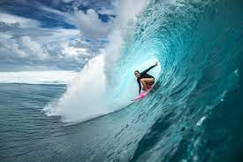

```{r setup, include=FALSE}
knitr::opts_chunk$set(echo = TRUE)
library(tidyverse)
```

# Header 1

## Header 2

### Header 3

#### Header 4

*Joe DeCesaro* and **Joe DeCesaro**

Joe^DeCesaro^ and Joe~DeCesaro~


Fruit Types

    -Apples
      -Red Apples
      -Green Apples
    -Bananas

Surfing Image:


```{r}
fish_length <- seq(from = 0, to = 200, by = 1)

standard_weight <- function(a, b, length) {
  a*fish_length^b
}

milkfish <- standard_weight(a = 0.0905, b = 2.52, length = fish_length)

giant_trevally <- standard_weight(a = 0.0353, b = 3.05, length = fish_length)

great_barracuda <- standard_weight(a = 0.0181, b = 3.27, length = fish_length)

barracuda_data <- data.frame(fish_length, great_barracuda)

barracuda_data

```

```{r}
ggplot(data = barracuda_data, mapping = aes(x = fish_length, y = great_barracuda)) + 
  geom_point() +
  labs(x = "Length (cm)",
       y = "Standard Weight (grams)",
       title = "Baracuda Weight by Increasing Length")
```

